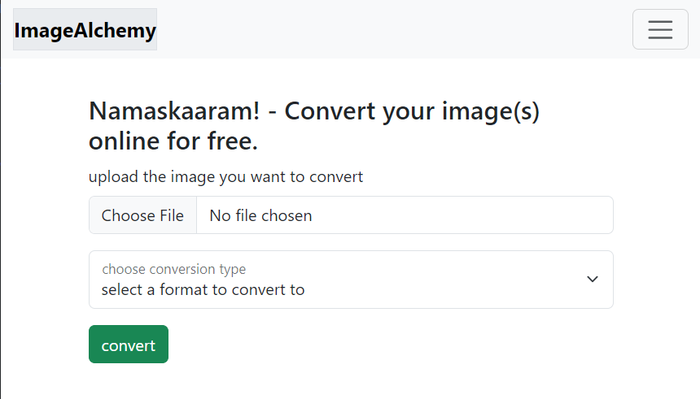
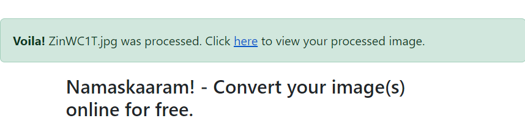
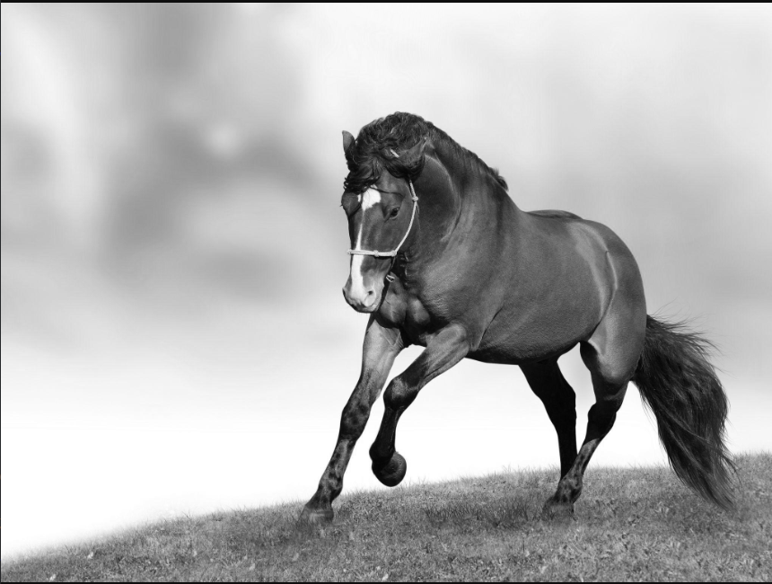

# ImageAlchemy
"ImageAlchemy" is an ImageConvertor using Python with the flask framework and OpenCV library! Images can be converted to Grayscale, PNG, JPEG/JPG, WebP and much more!

Using OpenCV library, you can add write more conversion cases in the
def processImage(filename, operation):
function!

NOTE: please add two folders in the root directory, static and uploads

